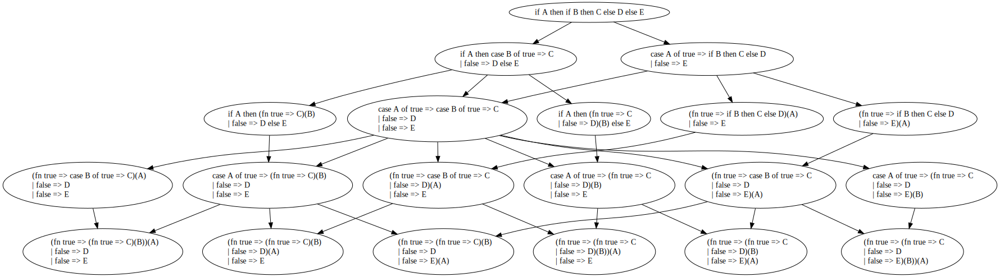

# Experiment 2
> Hand Rewriting to Check for Consistency & Confluence  

## Background
After noticing the distinctly intuition-guided nature of the selection of rewrites while performing Experiment 1, this experiment was developed as a follow-up with the aim of entirely eliminating human intuition from the selection of rewrites (though not necessarily from their application).  

The purpose of this experiment was to determine if the order in which rewrites are applied affects the final outcome; that is, it is to test if the rewriting system is _confluent_ or _non-confluent_. To this end, a simple expression was chosen (a singly-nested `if` expression) which our inspection determined was a likely candidate for non-confluence. We informally define non-confluence here to mean that selecting different orders and combinations of rewrites into Bare SML yields a different character string (the lexemes of the tokens in order). This condition is only checked once rewriting terminates (i.e. the string is in Bare SML); intermediate forms may differ without us classifying the entire rewrite as non-confluent.  

Many of the rewrites include what the SML '97 authors refer to as 'iterated constructs'; these are not strictly defined beyond giving the example of _match_, but an analysis of the text indicates this likely refers to any grammatical unit which optionally end in themselves (right-recursive). _match_ is a special case of this as `match ::= mrule <'|' match>`, `mrule :: pat '=>' exp`, and `exp ::= 'fn' match | exp 'handle' match` thus leading to potential cycles. The authors specify in the B Appendix that "Each iterated construct … extends as far right as possible", but we will check each possible selection of such iterated constructs as this was specified in the grammar appendix and not in the rewriting appendix, as well as because simply selecting the longest choice produces a semantically different outcome from what is observed when checking a reference implementation (Rossberg's _HaMLet_) on our example.  

## Method
1. In _HaMLet_, define the following environment:
	```
	val C = #"C";
	val D = #"D";
	val E = #"E";
	```
1. Beginning with the string `if A then if B then C else D else E`, note the results given by _HaMLet_ for each combination of `true` & `false` for `A` & `B`.
1. From the starting string, perform both possible rewrites and note the resulting strings.
	* `case A of true => if B then C else D | false => E`
	* `if A then case B of true => C | false => D else E`
1. Repeat step 2 for both strings and note the results.
1. Selecting both possible values of _match_ in each string, perform all six available rewrites; note the resulting strings and apply the same procedure as step 2 for each.
1. Continue rewriting and noting truth tables until all strings are in Bare SML.  

## Results

1. Source string: `if A then if B then C else D else E`  

|    1 | A: T | A: F |
|-----:|:----:|:----:|
| B: T |   C  |   E  |
| B: F |   D  |   E  |

---  

2. From 1: `case A of true => if B then C else D | false => E`  

| 2    | A: T | A: F |
|-----:|:----:|:----:|
| B: T |   C  |   E  |
| B: F |   D  |   E  |

3. From 1: `if A then case B of true => C | false => D else E`  

| 3    | A: T | A: F |
|-----:|:----:|:----:|
| B: T |   C  |   E  |
| B: F |   D  |   E  |

---  

4. From 2 & 3: `case A of true => case B of true => C | false => D | false => E`  

| 4    | A: T | A: F        |
|-----:|:----:|:-----------:|
| B: T |   C  | _exception_ |
| B: F |   D  | _exception_ |

5. From 2: `(fn true => if B then C else D)(A) | false => E`  

| 5    | A: T           | A: F           |
|-----:|:--------------:|:--------------:|
| B: T | _syntax error_ | _syntax error_ |
| B: F | _syntax error_ | _syntax error_ |

6. From 2: `(fn true => if B then C else D | false => E)(A)`  

| 6    | A: T | A: F |
|-----:|:----:|:----:|
| B: T |   C  |   E  |
| B: F |   D  |   E  |

7. From 3: `if A then (fn true => C)(B) | false => D else E`  

| 7    | A: T           | A: F           |
|-----:|:--------------:|:--------------:|
| B: T | _syntax error_ | _syntax error_ |
| B: F | _syntax error_ | _syntax error_ |

8. From 3: `if A then (fn true => C | false => D)(B) else E`  

| 8    | A: T | A: F |
|-----:|:----:|:----:|
| B: T |   C  |   E  |
| B: F |   D  |   E  |

---  

9. From 4: `(fn true => case B of true => C)(A) | false => D | false => E`  

| 9    | A: T           | A: F           |
|-----:|:--------------:|:--------------:|
| B: T | _syntax error_ | _syntax error_ |
| B: F | _syntax error_ | _syntax error_ |

10. From 4 & 5: `(fn true => case B of true => C | false => D)(A) | false => E`  

| 10   | A: T           | A: F           |
|-----:|:--------------:|:--------------:|
| B: T | _syntax error_ | _syntax error_ |
| B: F | _syntax error_ | _syntax error_ |

11. From 4 & 6: `(fn true => case B of true => C | false => D | false => E)(A)`  

| 11   | A: T | A: F        |
|-----:|:----:|:-----------:|
| B: T |   C  | _exception_ |
| B: F |   D  | _exception_ |

12. From 4 & 7: `case A of true => (fn true => C)(B) | false => D | false => E`  

| 12   | A: T        | A: F |
|-----:|:-----------:|:----:|
| B: T |   C         |   D  |
| B: F | _exception_ |   D  |

13. From 4 & 8: `case A of true => (fn true => C | false => D)(B) | false => E`  

| 13   | A: T | A: F |
|-----:|:----:|:----:|
| B: T |   C  |   E  |
| B: F |   D  |   E  |

14. From 4: `case A of true => (fn true => C | false => D | false => E)(B)` 
 
| 14   | A: T | A: F        |
|-----:|:----:|:-----------:|
| B: T |   C  | _exception_ |
| B: F |   D  | _exception_ |

---  

15. From 9 & 12: `(fn true => (fn true => C)(B))(A) | false => D | false => E`  

| 15   | A: T           | A: F           |
|-----:|:--------------:|:--------------:|
| B: T | _syntax error_ | _syntax error_ |
| B: F | _syntax error_ | _syntax error_ |

16. From 10 & 12: `(fn true => (fn true => C)(B) | false => D)(A) | false => E`  

| 16   | A: T           | A: F           |
|-----:|:--------------:|:--------------:|
| B: T | _syntax error_ | _syntax error_ |
| B: F | _syntax error_ | _syntax error_ |

17. From 10 & 13: `(fn true => (fn true => C | false => D)(B))(A) | false => E`  

| 17   | A: T           | A: F           |
|-----:|:--------------:|:--------------:|
| B: T | _syntax error_ | _syntax error_ |
| B: F | _syntax error_ | _syntax error_ |

18. From 11 & 12: `(fn true => (fn true => C)(B) | false => D | false => E)(A)`  

| 18   | A: T        | A: F |
|-----:|:-----------:|:----:|
| B: T |   C         |   D  |
| B: F | _exception_ |   D  |

19. From 11 & 13: `(fn true => (fn true => C | false => D)(B) | false => E)(A)`  

| 19   | A: T | A: F |
|-----:|:----:|:----:|
| B: T |   C  |   E  |
| B: F |   D  |   E  |

20. From 11 & 14: `(fn true => (fn true => C | false => D | false => E)(B))(A)`  

| 20   | A: T | A: F        |
|-----:|:----:|:-----------:|
| B: T |   C  | _exception_ |
| B: F |   D  | _exception_ |

---

Structuring the different nodes into a graph yields the following:
  


## Analysis
Of the six ending states, numbers 18, 19, & 20 terminated due to passing the recogniser check (they are fragments in Bare SML). The other three terminated due to no further rewrites being applicable. The forms which produced syntax errors did so due to a choice for _match_ which left hanging cases when converting to the anonymous function form. The forms which produced evaluation-time errors when `A = false` did so because of a choice for the inside _match_ which was too expansive and left the outside case inexhaustive. Only one of the three syntactically-valid ending states retained the same semantics as the starting state, the other two raised exceptions for an inexhaustive match for some combination(s) of inputs.  

## Conclusions
While the non-confluence is to be expected given the notes in the SML '97 specification about choosing the longest option for each iterated construct, it is interesting that this turned out to be an insufficient/incorrect remediation. Notably, choosing the longest option for _match_ at each point where such a choice can be made leads to paths such as 1 → 2/3 → 4 → 11/14 → 20 where the inner _match_ takes away the `false` case from the outer _match_ and shadows it behind its own `false` case. Other places in the document mention a need for `()` around certain constructs in other contexts, so the lack of a similar mitigation here is interesting. While wrapping these constructs in `()` in many places would help, this demonstrates a key advantage for the term/tree-based rewriting approach we detail in the body of the paper.  
